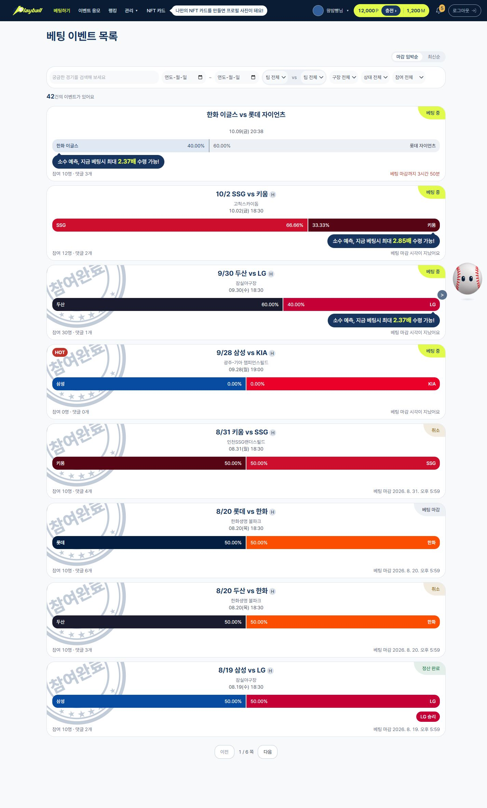
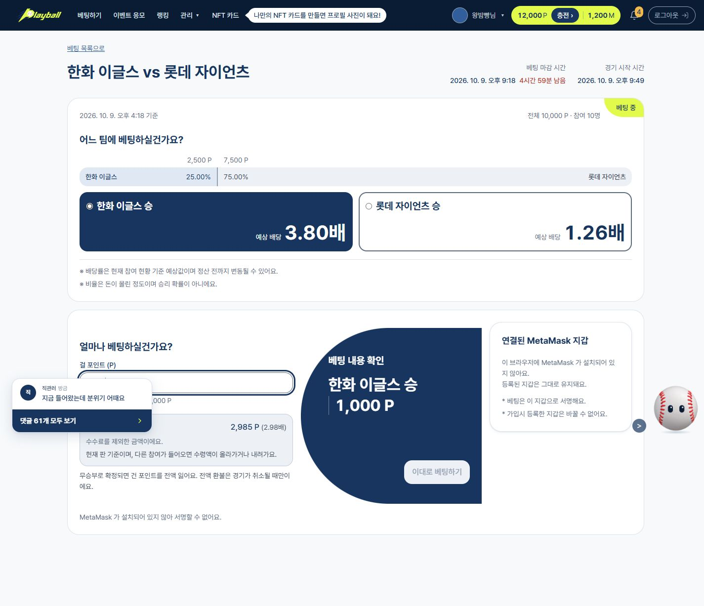
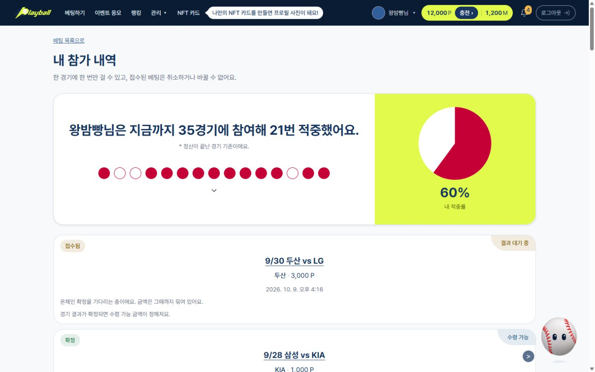
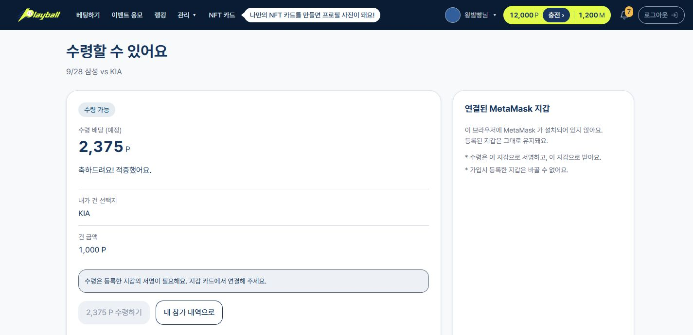

# PLAYBALL | KBO予測プラットフォーム

[한국어](./README.md)

> **公開範囲**：SSAFYの方針により、プロジェクトのソースコードを外部リポジトリへ持ち出すことはできません。そのため、このリポジトリではサービスと技術設計を紹介するREADME文書と、実際のフロントエンド画面のキャプチャのみを公開します。ソースコードは含まれていません。

> **画面キャプチャについて**：試合・残高・精算のデータはmockアダプターによるデモ用の例です。撮影時にはMetaMaskがインストールされていなかったため、ベットと受け取りの署名ボタンは無効になっています。キャプチャは実際のオンチェーン取引の完了を証明するものではありません。

PlayBallは、KBOの試合情報を確認し、結果を予測して参加するブロックチェーン基盤のスポーツサービスです。ユーザーはウォレットでベッティング内容に署名し、参加記録、結果の確定、配当・返金をスマートコントラクト上で確認できます。

## 1. サービス全体の流れ

| 段階 | ユーザー体験 | システム側の処理 |
|---|---|---|
| 試合を探す | 日程、詳細、参加状況を確認 | 公開されている試合・マーケット情報を提供 |
| 情報を確認 | 両チームの記録や関連情報を確認 | AIが根拠に基づく事実情報を偏りなく提供 |
| 参加の準備 | ログイン、ウォレット接続、ポイントの準備 | アカウントとウォレットを紐付け、チャージとミントの状態を区別 |
| ベットを受け付ける | 選択肢と金額を確認して署名 | EIP-712署名の検証、受付、バッチ送信 |
| チェーン上で確定 | 参加状況を確認 | インデクサーがコントラクトのイベントを参照用DBに反映 |
| 結果確定・受け取り | 的中配当または中止時の返金を受け取る | コントラクトで結果を確定し、`claimFor`を実行 |

AIは情報提供のみを担当します。勝敗の推奨や配当、結果確定、精算の判断には関与しません。

*実際のフロントエンド画面 · 試合の検索と参加状況（mockデータ）*

## 2. 主要機能 — ベッティング

### 詳細画面から署名まで

ベッティング詳細画面では、選択肢、現在のオッズ、金額入力、署名と受付の状態を一つの流れで確認できます。表示される予想オッズは現在の参加状況に基づく参考値であり、最終的な受取額を保証するものではありません。

*実際のフロントエンド画面 · チーム選択、1,000 Pの入力、予想受取額の表示（mockデータ）*

### 署名したリクエストがチェーン上の記録になるまで

1. ユーザーが選択肢と金額を決め、EIP-712メッセージに署名します。メッセージには期限と再利用防止用のnonceも含まれます。
2. バックエンドが署名と残高などを確認してリクエストを受け付けます。**受付はオンチェーンでの確定とは異なる状態**です。
3. リレイヤーが複数のリクエストをまとめて`PredictionMarket.placeBetBatch`に送信し、ガス代を負担します。
4. コントラクトが各リクエストの署名・残高・期限・nonceの使用状況を検証して預託し、項目ごとの成功または拒否をイベントに記録します。
5. インデクサーがチェーンログを読み、参照用DBに反映します。画面では受付待ち（`QUEUED`）、チェーン上での確定（`CONFIRMED`）、拒否（`REJECTED`）を区別します。

*実際のフロントエンド画面 · 受付待ちと精算状態を区別した参加履歴（mockデータ）*

| 設計要素 | 解決する課題 |
|---|---|
| EIP-712 | ユーザーがベッティング内容に署名し、リレイヤーが代理で送信できるようにします。 |
| BitmapNonce | 署名の再利用を防ぎ、複数のリクエストを独立して処理します。 |
| バッチ送信 | 複数のベットを一度のオンチェーン送信にまとめます。 |
| 項目ごとの結果 | 一件の拒否によってバッチ全体が取り消されることを防ぎます。 |

## 3. 主要機能 — ブロックチェーンでの精算

マーケットは`OPEN`から結果に応じて`SETTLED`または`CANCELLED`へ移行します。管理者が試合結果を入力すると、コントラクトの`settle`または`cancel`の呼び出しによって確定します。的中者への配当と中止された参加の返金は、署名に基づく`claimFor`で支払われます。

*実際のフロントエンド画面 · 受取可能額とウォレット署名の案内（mockデータ）*

| コントラクト・構成要素 | 役割 |
|---|---|
| `PredictionMarket` | マーケット作成、ベットの預託、結果確定・中止、配当・返金処理 |
| `PointToken` | 参加に使用するポイントトークンの発行・移動・焼却 |
| `BitmapNonce` | 署名済みリクエストの再利用防止 |
| リレイヤー | ユーザーが署名したリクエストのオンチェーン送信 |
| インデクサー | チェーンログを収集し、画面表示用の状態に反映 |

### チェーン上の状態を画面に反映する経路

リレイヤーはトランザクションを送信し、インデクサーは確定したチェーンログを読んで参照用の状態を更新します。サーバーDBは画面表示用の投影であり、ベットの預託、結果、支払いの根拠はコントラクトの記録です。

## 4. その他の機能

| 機能 | ユーザー体験と処理範囲 |
|---|---|
| AIによる試合情報 | 両チームの記録と根拠を事実中心に表示します。予測・推奨や精算には関与しません。 |
| ポイント | チャージの申請とトークンのミント確定を区別して進行状況を表示します。 |
| 抽選イベント | マイレージで応募し、抽選結果を確認します。重み付き抽選はサーバーで実行し、結果と再現可能な監査情報を公開します。 |
| NFTカード | ユーザーの画像生成結果のCIDを基に発行用署名を受け取り、`PlayerCard`をオンチェーンに記録します。 |

## 5. システム構成

Reactフロントエンドがユーザー向けの画面を提供し、NestJSバックエンドがAPI、リレイヤー、インデクサーを運用します。Solidityコントラクトはトークンと予測マーケットを担当します。AIサービスの役割は試合情報の提供に限定しています。

> **デモの範囲**：開発環境ではmockアダプターによる画面デモもサポートしています。デモデータは実際のオンチェーン送信・確定を証明するものではありません。
